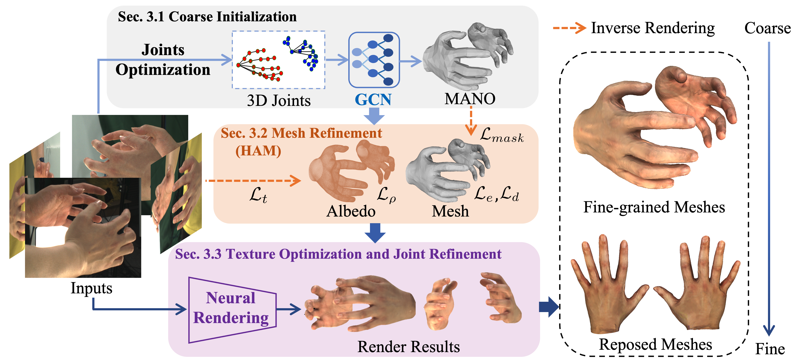

<div align="center">
<h1>Fine-Grained Multi-View Hand Reconstruction Using Inverse Rendering</h1>

[Qijun Gan](https://github.com/agnJason), [Wentong Li](https://cslwt.github.io/), [Jinwei Ren ](https://github.com/zijinxuxu), [Jianke Zhu](https://scholar.google.cz/citations?user=SC-WmzwAAAAJ) <sup>:email:</sup>

Zhejiang University

(<sup>:email:</sup>) corresponding author.

[Paper](https://ojs.aaai.org/index.php/AAAI/article/download/27946/27912)

</div>

#
### News
* **`Jun. 13st, 2024`:** 🌟We released our source code!

## Abstract

Reconstructing high-fidelity hand models with intricate tex- tures plays a crucial role in enhancing human-object interac- tion and advancing real-world applications. Despite the state- of-the-art methods excelling in texture generation and image rendering, they often face challenges in accurately capturing geometric details. Learning-based approaches usually offer better robustness and faster inference, which tend to produce smoother results and require substantial amounts of training data. To address these issues, we present a novel fine-grained multi-view hand mesh reconstruction method that leverages inverse rendering to restore hand poses and intricate details. Firstly, our approach predicts a parametric hand mesh model through Graph Convolutional Networks (GCN) based method from multi-view images. We further introduce a novel Hand Albedo and Mesh (HAM) optimization module to refine both the hand mesh and textures, which is capable of preserv- ing the mesh topology. In addition, we suggest an effec- tive mesh-based neural rendering scheme to simultaneously generate photo-realistic image and optimize mesh geometry by fusing the pre-trained rendering network with vertex fea- tures. We conduct the comprehensive experiments on Inter- Hand2.6M, DeepHandMesh and dataset collected by ourself, whose promising results show that our proposed approach outperforms the state-of-the-art methods on both reconstruc- tion accuracy and rendering quality.
## Introduction



Overview of our coarse-to-fine framework. Given a set of calibrated images, we initialize MANO parameters and refine the mesh using our proposed HAM module and inverse rendering to achieve geometric details. By jointly optimizing the mesh using a model-based neural rendering, a fine-grained mesh can be obtained along with its hyper-realistic rendered images.

**Notes**: 

- All the experiments are performed on 1 NVIDIA GeForce RTX 3090Ti GPU.


## Getting Started

### Install 

**a. Create a conda virtual environment and install required packages.**
```shell
git clone git@github.com:agnJason/FMHR.git
conda create -n FMHR python=3.10 -y
conda activate FMHR

pip install torch==2.1.2 torchvision==0.16.2 torchaudio==2.1.2 --index-url https://download.pytorch.org/whl/cu118
pip install -r requirement.txt
```

**b. Prepare MANO models.**

Besides, you also need to download the MANO model. Please visit the [MANO website](https://mano.is.tue.mpg.de/) and register to get access to the downloads section. You need to put MANO_RIGHT.pkl and MANO_LEFT.pkl under the ./mano folder.

### Data from Interhand2.6M
Edit your Interhand2.6M PATH in [conf/ih_sfs.conf](conf/ih_sfs.conf)->data_path, which should contain ./images and ./annotations.
```bash
# Mesh optim with MANO annotations, change capture/name in conf/ih_sfs.conf
python mesh_sfs_optim.py --conf conf/ih_sfs.conf --scan_id 0

# Train Neural renderer
python neural_render.py --conf conf/ih_sfs.conf --scan_id 0  --net_type mlp
```
The output should be in `./interhand_out`.

### Data from Capture Room

Prepare MANO paramters.
```bash
# optim 3d pose
python pose_optim.py --data_path ./demo_data --scan_id 1 --out_path ./demo_out
# optim mano para
python mano_optim.py --data_path ./demo_data --scan_id 1 --out_path ./demo_out
```
Mesh optim.
```
# Mesh optim
python mesh_sfs_optim.py --conf ./conf/demo_sfs.conf --data_path ./demo_data --scan_id 1
```
The output will be in `./demo_out`.

(Optional) MANO parameters can also be predicted by GCN-base network.
```bash
python multihands_mano.py --conf ./conf/demo_sfs.conf --data_path ./demo_data --scan_id 1
```

## Citation
If you find our project is useful in your research or applications, please consider giving us a star 🌟 and citing it by the following BibTeX entry.
```bibtex
@inproceedings{gan2024fine,
  title={Fine-Grained Multi-View Hand Reconstruction Using Inverse Rendering},
  author={Gan, Qijun and Li, Wentong and Ren, Jinwei and Zhu, Jianke},
  booktitle={AAAI},
  pages={1779--1787},
  year={2024}
}

```

